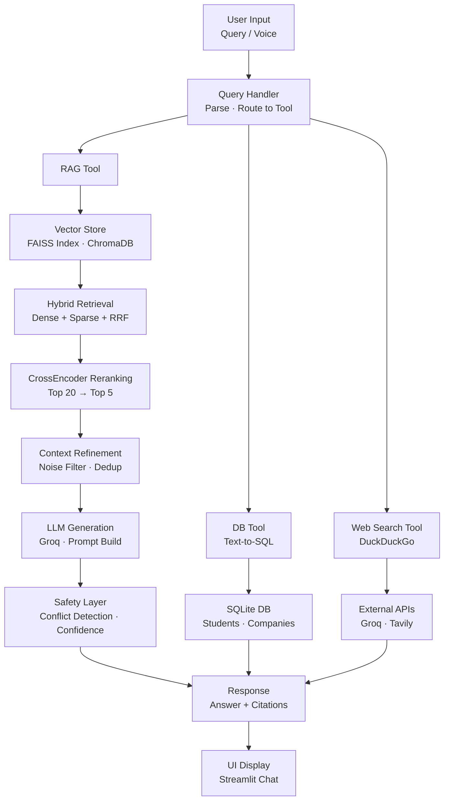
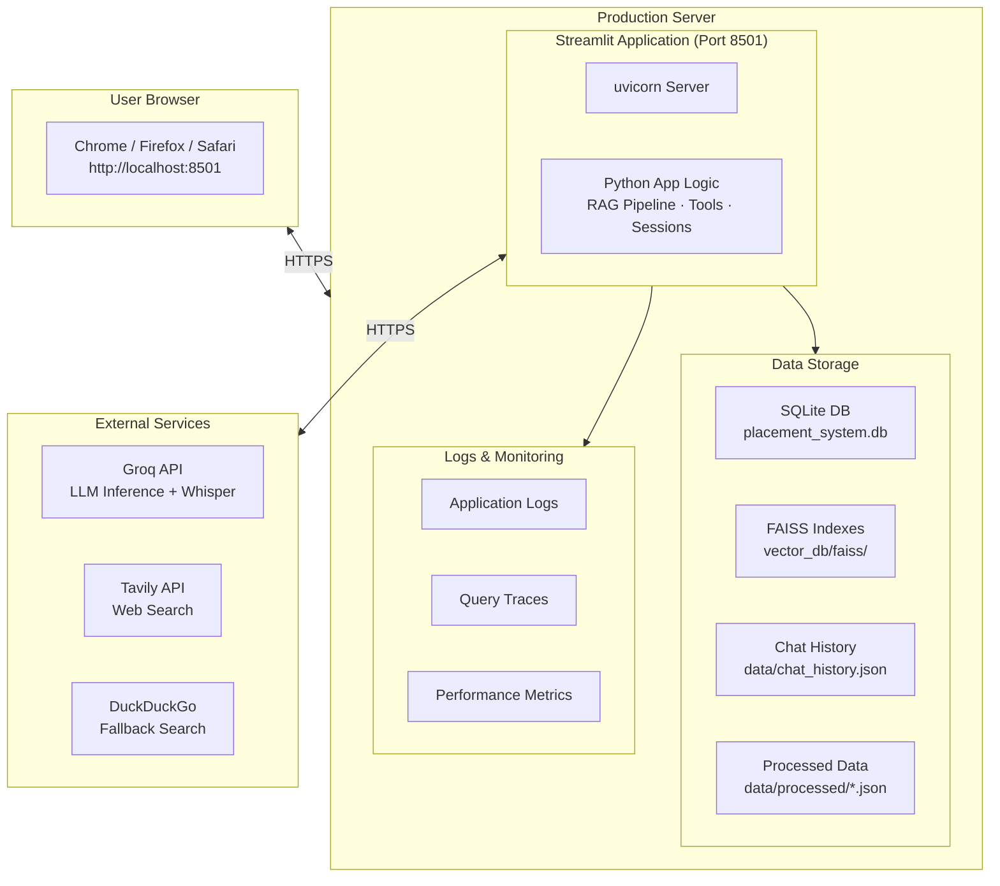

# Placement Intelligence Assistant


**Production-Grade Hybrid Multimodal RAG System with LLM Agent Tool Routing for Placement Data Analysis**

---

## Table of Contents

- [Overview](#overview)
- [Motivation](#motivation)
- [Features](#features)
- [Technology Stack](#technology-stack)
- [Installation](#installation)
- [Usage](#usage)
- [Architecture](#architecture)
- [UML Diagrams](#uml-diagrams)
- [Project Structure](#project-structure)
- [Configuration](#configuration)
- [Dataset](#dataset)
- [Evaluation](#evaluation)
- [Scripts](#scripts)
- [Dependencies](#dependencies)
- [Design Principles](#design-principles)
- [Credits](#credits)
- [Contributing](#contributing)
- [Tests](#tests)
- [License](#license)

---

## Overview

The Placement Intelligence Assistant is a production-grade Agentic Retrieval-Augmented Generation (RAG) system designed for college placement intelligence. It implements a modular 6-stage architecture with hybrid retrieval, multimodal support, safety layers, LLM-based query intent routing, and real database and web search integration. The system follows SOLID principles and clean architecture patterns.

### What This Project Does

The system helps students and placement coordinators quickly access and analyze placement data through a conversational AI interface and interactive tools. Users can:

- Ask natural language questions about company eligibility criteria (CGPA, backlogs, packages, bonds)
- Check live company updates (CEOs, hiring status) using integrated Web Search
- Query relational student placement records using an LLM-powered Text-to-SQL Database Tool
- Perform semantic resume skill gap analyses and get tailored matching recommendations
- Access dedicated portals for placement eligibility checks and side-by-side company comparison

The system provides accurate, context-aware answers with citations from the source documents.

---

## Motivation

### Why I Built This Project

I built this project to solve a common problem faced by engineering students: the difficulty of finding accurate, up-to-date placement information across multiple companies. Students often have to search through multiple PDFs and documents, navigate confusing company portals, rely on outdated or conflicting information, and spend hours manually comparing eligibility criteria.

### Problem It Solves

This system addresses these challenges by:

- **Centralizing Information**: All placement data in one searchable system
- **Natural Language Queries**: Ask questions in plain English, no technical knowledge needed
- **Accurate Citations**: Every answer includes source references for verification
- **Conflict Detection**: Identifies and resolves conflicting information between official and portal data
- **Real-time Analytics**: Dashboard with system health, pipeline stages, and query history

### What I Learned

Building this project taught me:

- **RAG Architecture**: Deep understanding of retrieval-augmented generation pipelines
- **Hybrid Search**: Combining dense (vector) and sparse (keyword) search for better results
- **Clean Architecture**: Implementing SOLID principles and dependency injection
- **LLM-Based Agent Tool Routing**: Dynamically routing queries to Web Search, SQL Database, Calculator, Opinion Guard, or RAG
- **SQL Database Tool & SQLite DB**: A real SQLite database populated with student records and company profiles, queried securely using LLM Text-to-SQL
- **Web Search Tool**: DuckDuckGo integration to fetch live out-of-corpus data dynamically
- **Voice Input & Transcription**: Groq Whisper API integration for audio-to-text with multi-language support (English, Telugu, Hindi)

---

## Features

### AI-Powered Capabilities

- **LLM-Based Tool Router**: Automatically classifies queries and routes to appropriate tools (Database, Web Search, Calculator, Opinion Guard, or RAG)
- **SQL Database Tool**: Text-to-SQL engine for querying student placement records using natural language
- **Web Search Tool**: DuckDuckGo integration with AI-powered answer generation for live out-of-corpus data
- **Calculator Tool**: Safe mathematical operations for CGPA conversions, averages, and calculations
- **Opinion Guard**: Factual company comparisons without bias or subjective recommendations
- **Resume Analyzer**: AI-powered skill gap analysis with PDF/DOCX/TXT support and tailored recommendations
- **Voice Input**: Groq Whisper API for audio transcription with multi-language support (English, Telugu, Hindi)

### RAG Pipeline Features

- **6-Stage Architecture**: Ingestion → Retrieval → Reranking → Refinement → Generation → Safety
- **Hybrid Retrieval**: Dense vector (FAISS) + Sparse (BM25) with Reciprocal Rank Fusion (RRF)
- **CrossEncoder Reranking**: Top-20 retrieval → Top-5 reranking for improved precision
- **Multi-Hop Retrieval**: Cross-document reasoning with query rewriting
- **Context Refinement**: Overshadow limiter, noise filtering, and deduplication
- **Safety Layer**: Conflict detection, out-of-corpus fallback, confidence scoring
- **System Reliability**: System 2 Attention (S2A), Self-Consistency, and Recitation Checking

### User Interface

- **ChatGPT-Style UI**: Modern Streamlit interface with real-time chat
- **Multi-Session Chat History**: Persistent chat sessions with auto-generated titles
- **Chat Export**: Export sessions as JSON for sharing
- **Eligibility Checker**: Interactive form to check eligible companies based on CGPA, branch, and backlogs
- **Resume Analyzer**: Drag-and-drop resume upload with AI gap analysis
- **Company Comparison**: Side-by-side comparison of packages, cutoffs, bonds, and skills
- **System Analytics**: Dashboard with chunk inspection, query history, and latency tracking
- **Reliability Metrics**: Real-time display of groundedness and self-consistency scores

### Data & Storage

- **SQLite Database**: Real relational database with student and company tables
- **Vector Storage**: Multiple vector store backends (FAISS, Chroma, Pinecone, Qdrant)
- **Persistent Chat History**: JSON-based storage surviving refresh/restart
- **Query Tracing**: Detailed trace logs for debugging and analysis
- **Processed Datasets**: 8 JSON files with eligibility, hiring, interview, and trend data

---

## Technology Stack

| Category | Technology |
|---|---|
| **Language** | Python 3.8+ |
| **UI Framework** | Streamlit 1.32+ |
| **RAG Orchestration** | LangChain 0.2+ |
| **LLM Inference** | Groq (Llama models) |
| **Embeddings** | Sentence Transformers 3.0+ (all-MiniLM-L6-v2) |
| **Vector Search** | FAISS-CPU 1.7.4, ChromaDB 0.4.0 |
| **Keyword Search** | Rank-BM25 0.2.2 |
| **Reranking** | CrossEncoder (Transformers 4.45+) |
| **Deep Learning** | PyTorch 2.3+ |
| **PDF Processing** | PyPDF 4.0+, PDFPlumber 0.11+, Camelot-Py 0.11+ |
| **OCR** | PyTesseract 0.3.10+, Pillow 10.0+ |
| **Database** | SQLite, MySQL Connector 8.0+ |
| **Data Processing** | NumPy 1.26+, Pandas 2.2+, Scikit-learn 1.4+ |
| **Visualization** | Plotly 5.18+ |
| **Web Search** | DuckDuckGo, Tavily-Python 0.3.3 |
| **Logging** | Python-JSON-Logger 2.0.7 |

---

## Installation

### Prerequisites

- Python 3.8+
- pip package manager
- Minimum 8GB RAM (16GB recommended for vector operations)
- Minimum 5GB free storage

### Setup

1. Clone the repository:

```bash
git clone <repository-url>
cd placement_rag_sys
```

2. Create a virtual environment:

```bash
python -m venv .venv
source .venv/bin/activate  # On Windows: .venv\Scripts\activate
```

3. Install dependencies:

```bash
pip install -r requirements.txt
```

4. Set up environment variables:

```bash
cp .env.example .env
# Edit .env with your API keys
```

```env
GROQ_API_KEY=your_groq_api_key_here
TAVILY_API_KEY=your_tavily_api_key_here   # Optional
GOOGLE_API_KEY=your_google_api_key_here   # Optional
```

---

## Usage

### Streamlit UI (Recommended)

```bash
streamlit run ui/app.py
```

The UI opens in your browser at `http://localhost:8501`

### Dashboard Tabs

| Tab | Description |
|---|---|
| 💬 Chat Assistant | ChatGPT-like RAG chatbot with LLM agentic tool execution logs |
| 🎤 Voice Input | Audio recording with Groq Whisper API (English, Telugu, Hindi) |
| ✅ Eligibility Checker | Form showing eligible/ineligible companies based on CGPA and backlogs |
| 📄 Resume Analyzer | Drag-and-drop resume upload with talent gap and alignment analysis |
| ⚖️ Company Compare | Side-by-side comparison of packages, cutoffs, bonds, and stacks |
| 📊 System Analytics | Observability dashboard with chunk inspection and latency tracking |

### Chat History System

- **New Chat Button**: Create new chat sessions
- **Previous Sessions**: View and switch between previous sessions
- **Auto-Generated Titles**: Session titles generated from the first user query
- **Persistent Storage**: Chat history saved to `data/chat_history.json` and survives refresh/restart

### Python API

```python
from core.pipeline import RAGPipeline
from ingestion.parser import MultimodalParser
from ingestion.chunker import SectionChunker
from ingestion.embedder import SentenceTransformerEmbedder
from retrieval.retriever import HybridRetriever
from retrieval.reranker import CrossEncoderReranker
from generation.refiner import ContextRefiner
from generation.generator import GroqGenerator
from safety.conflict_detector import ConflictDetector

# Initialize and create pipeline
pipeline = RAGPipeline(
    parser=MultimodalParser(),
    chunker=SectionChunker(),
    embedder=SentenceTransformerEmbedder(),
    retriever=HybridRetriever(...),
    reranker=CrossEncoderReranker(),
    refiner=ContextRefiner(),
    generator=GroqGenerator(),
    safety_checker=ConflictDetector()
)

# Ingest documents
pipeline.ingest("data/Placement_Dataset.pdf")

# Query the system
result = pipeline.query("What is the CGPA requirement for Google?")
print(result["answer"])
```

### Query Examples

| Difficulty | Example |
|---|---|
| Easy | "What is the CGPA requirement for TCS?" |
| Easy | "How many backlogs does Deloitte allow?" |
| Medium | "List all companies that allow at least 2 backlogs." |
| Medium | "Which companies require a CGPA above 8.0?" |
| Hard | "A student with CGPA 7.0, 1 backlog wants maximum pay with no bond." |
| Hard | "Is the Amazon CGPA cutoff 6.4 or 7.0? Explain." |
| Expert | "What is TCS's campus visit date at SVECW?" (Out-of-corpus fallback) |

---

## Architecture

### 6-Stage RAG Pipeline

**Stage 0 — Ingestion & Routing**: Parse → Chunk → Embed → Index → Route
Multimodal parser (PDF, Excel, OCR), section-aware chunking, SentenceTransformer embeddings, FAISS + BM25 hybrid indexing, and LLM agent routing dispatching to SQL Database, Web Search, Calculator, Opinion Guard, or RAG.

**Stage 1 — Retrieval**: Dense + Sparse search with FAISS vector similarity, BM25 keyword search, Reciprocal Rank Fusion (RRF), SQL student DB, and DuckDuckGo fallback.

**Stage 2 — Reranking**: Retrieve top-20 chunks, rerank to top-5 with CrossEncoder for improved contextual precision.

**Stage 3 — Refinement**: ContextRefiner for noise filtering, OvershadowLimiter for context cap, and deduplication.

**Stage 4 — Generation**: PromptBuilder with grounded instructions and Groq LLM integration for citation-aware generation.

**Stage 5 — Safety & Reliability**: Conflict detection (official vs portal), out-of-corpus fallback, confidence scoring, System 2 Attention (S2A), Self-Consistency, and Recitation Checking.

---

## UML Diagrams

### 1. Class Diagram — SOLID Architecture

```mermaid
classDiagram
    class RAGPipeline {
        -parser: IParser
        -chunker: IChunker
        -embedder: IEmbedder
        -vector_store: IVectorStore
        -retriever: IRetriever
        -reranker: IReranker
        -refiner: IRefiner
        -generator: IGenerator
        -safety_checker: ISafetyChecker
        +ingest(file_path: str) void
        +query(query: str) dict
        +batch_query(queries: list) list
    }

    class IParser {
        <<interface>>
        +parse(file_path: str) List~Document~
    }

    class MultimodalParser {
        +parse(file_path: str) List~Document~
        -parse_pdf(file_path) List~Document~
        -parse_docx(file_path) List~Document~
        -ocr_scan(file_path) List~Document~
    }

    class IChunker {
        <<interface>>
        +chunk(documents: list) List~Chunk~
    }

    class SectionChunker {
        -chunk_size: int
        -chunk_overlap: int
        +chunk(documents: list) List~Chunk~
    }

    class IEmbedder {
        <<interface>>
        +embed(text: str) List~float~
        +embed_batch(texts: list) List~List~
    }

    class SentenceTransformerEmbedder {
        -model_name: str
        -device: str
        +embed(text: str) List~float~
        +embed_batch(texts: list) List~List~
    }

    class IRetriever {
        <<interface>>
        +retrieve(query: str, top_k: int) List~Chunk~
    }

    class HybridRetriever {
        -vector_store: IVectorStore
        -embedder: IEmbedder
        -bm25: BM25
        +retrieve(query: str, top_k: int) List~Chunk~
        -dense_search(query, top_k) List~Chunk~
        -sparse_search(query, top_k) List~Chunk~
        -reciprocal_rank_fusion(results) List~Chunk~
    }

    class IReranker {
        <<interface>>
        +rerank(chunks: list, query: str, top_k: int) List~Chunk~
    }

    class CrossEncoderReranker {
        -model_name: str
        -device: str
        +rerank(chunks: list, query: str, top_k: int) List~Chunk~
    }

    class IGenerator {
        <<interface>>
        +generate(query: str, context: list) str
    }

    class GroqGenerator {
        -model_name: str
        -api_key: str
        +generate(query: str, context: list) str
    }

    class ISafetyChecker {
        <<interface>>
        +check(answer: str, context: list) dict
    }

    class ConflictDetector {
        +check(answer: str, context: list) dict
        -detect_conflicts(context) List~Conflict~
        -calculate_confidence(answer, context) float
    }

    RAGPipeline --> IParser
    RAGPipeline --> IChunker
    RAGPipeline --> IEmbedder
    RAGPipeline --> IRetriever
    RAGPipeline --> IReranker
    RAGPipeline --> IGenerator
    RAGPipeline --> ISafetyChecker

    IParser <|.. MultimodalParser
    IChunker <|.. SectionChunker
    IEmbedder <|.. SentenceTransformerEmbedder
    IRetriever <|.. HybridRetriever
    IReranker <|.. CrossEncoderReranker
    IGenerator <|.. GroqGenerator
    ISafetyChecker <|.. ConflictDetector
```



---

### 2. Data Flow Diagram



---

### 3. Deployment Diagram



---

## Project Structure

```
placement_rag_sys/
├── core/                    # SOLID interfaces and orchestrator
│   ├── interfaces.py       # Abstract base classes
│   └── pipeline.py         # 6-stage RAG orchestrator
├── ingestion/              # Stage 0: Parse → Chunk → Embed
│   ├── parser.py          # Multimodal document parser
│   ├── chunker.py         # Section-aware chunking
│   └── embedder.py        # SentenceTransformer embeddings
├── retrieval/              # Stages 1-2: Retrieve → Rerank
│   ├── retriever.py       # Hybrid FAISS + BM25
│   └── reranker.py        # CrossEncoder reranking
├── generation/             # Stages 3-4: Refine → Generate
│   ├── refiner.py         # Context refinement
│   ├── prompt_builder.py  # Grounded prompting
│   └── generator.py       # Groq LLM generation
├── safety/                 # Stage 5: Validation
│   ├── conflict_detector.py    # Conflict detection
│   ├── fallback_guard.py       # Out-of-corpus guard
│   └── overshadow_limiter.py   # Context cap
├── evaluation/             # Evaluation system
│   ├── queries.py         # 34 evaluation queries
│   ├── metrics.py         # Retrieval/answer metrics
│   └── evaluator.py       # Automated evaluator
├── feedback/               # AIMD feedback loop
│   └── loop.py            # Feedback controller
├── config/                 # Configuration management
│   └── settings.py        # System settings
├── ui/                     # Streamlit interface
│   └── app.py            # ChatGPT-style UI
├── scripts/                # Utility scripts
│   ├── ingest.py         # Ingestion pipeline
│   └── evaluate.py       # Evaluation pipeline
└── data/                   # Data storage
    ├── processed/        # Processed JSON data files
    └── raw/             # Raw data files
```

---

## Configuration

Configuration is managed through `config/settings.py`:

| Config Class | Purpose |
|---|---|
| `EmbeddingConfig` | Model name and device settings |
| `RetrievalConfig` | Top-k and reranking settings |
| `ChunkingConfig` | Chunk size and overlap |
| `GenerationConfig` | LLM and context settings |
| `SafetyConfig` | Thresholds and flags |
| `EvaluationConfig` | Evaluation paths |
| `DataConfig` | Data directory paths |
| `UIConfig` | UI settings |

---

## Dataset

The system uses a comprehensive placement dataset with 19 companies including:

- **Eligibility Profiles**: CGPA requirements, backlogs allowed, packages, bond periods
- **Interview Experiences**: Round details, technical focus, preparation tips
- **Hiring Distribution**: Role-wise hiring statistics (SDE, Analyst, Officer, Intern)
- **Temporal Trends**: Package trends from 2021–2024
- **Conflicting Records**: Official vs portal-scraped data for conflict detection
- **Overall Statistics**: Aggregate placement statistics

---

## Evaluation

The system includes 34 evaluation queries covering all difficulty levels.

```bash
python scripts/evaluate.py
```

| Metric Type | Metrics |
|---|---|
| Retrieval | Precision@K, Recall@K, MRR |
| Answer Quality | Exact match, keyword overlap, citation coverage |
| Multi-hop | Cross-document reasoning accuracy |

---

## Scripts

```bash
# Ingest documents into the pipeline
python scripts/ingest.py --file data/Placement_Dataset.pdf

# Run automated evaluation
python scripts/evaluate.py
```

---

## Dependencies

Key dependencies (see `requirements.txt` for full list):

- **Core**: `langchain`, `streamlit`, `python-dotenv`
- **Embeddings**: `sentence-transformers`, `faiss-cpu`
- **Retrieval**: `rank-bm25`, `nltk`
- **Reranking**: `sentence-transformers` (CrossEncoder)
- **LLM**: `groq`
- **PDF Processing**: `docling`, `pdfplumber`, `camelot-py`, `pymupdf`
- **OCR**: `pytesseract`, `pillow`
- **Database**: `sqlite3` (built-in), `mysql-connector-python`
- **Utilities**: `numpy`, `pandas`, `scikit-learn`, `tqdm`, `plotly`

---

## Design Principles

- **SOLID Principles**: Abstract interfaces for all components
- **Clean Architecture**: Separation of concerns with clear boundaries
- **Loose Coupling**: Dependency injection and interface-based design
- **Config-Driven**: All settings managed through configuration classes
- **Production-Ready**: Error handling, logging, and monitoring throughout

---

## Credits

### Author

Developed as a production-grade RAG system for placement intelligence as part of RAG-ATHON 24.

### Acknowledgments

- **Dataset**: Placement Intelligence Assistant Dataset — RAG-ATHON 24
- **Frameworks**: LangChain, Streamlit, FAISS
- **Models**: Sentence-transformers (all-MiniLM-L6-v2), Groq Llama models, CrossEncoder
- **Inspiration**: Best practices from the RAG community and open-source projects

If you found this project helpful or used it as a reference, please consider giving it a ⭐ on GitHub!

---

## Contributing

### How to Contribute

1. Fork the repository
2. Create a feature branch: `git checkout -b feature/amazing-feature`
3. Make your changes and add tests for new features
4. Commit your changes: `git commit -m 'Add amazing feature'`
5. Push to the branch: `git push origin feature/amazing-feature`
6. Open a Pull Request

### Contribution Guidelines

- Follow the existing code style (PEP 8)
- Add docstrings to new functions and classes
- Update the README if you add new features
- Ensure backward compatibility
- Write tests for new functionality

### Reporting Issues

1. Check existing issues to avoid duplicates
2. Use a clear and descriptive title
3. Provide detailed information and steps to reproduce
4. Add relevant logs or error messages

---

## Tests

### Running Tests

```bash
python test_evaluation_queries.py
```

### Test Coverage

- **Evaluation Query Tests**: 34 pre-defined queries covering eligibility, interviews, hiring, trends, and statistics
- **Multi-hop Queries**: Complex queries requiring cross-document reasoning
- **Metrics**: Precision@K, Recall@K, MRR for retrieval; exact match, keyword overlap, citation coverage for answers

### Future Testing Plans

- Unit tests for individual components (parser, chunker, embedder, retriever)
- Integration tests for the full pipeline
- Performance benchmarks for retrieval and generation
- Safety layer validation tests

---

## License

```
MIT License

Copyright (c) 2026 SVECW — Department of Information Technology

Permission is hereby granted, free of charge, to any person obtaining
a copy of this software and associated documentation files (the
"Software"), to deal in the Software without restriction, including
without limitation the rights to use, copy, modify, merge, publish,
distribute, sublicense, and/or sell copies of the Software, and to
permit persons to whom the Software is furnished to do so, subject to
the following conditions:

The above copyright notice and this permission notice shall be included
in all copies or substantial portions of the Software.

THE SOFTWARE IS PROVIDED "AS IS", WITHOUT WARRANTY OF ANY KIND,
EXPRESS OR IMPLIED, INCLUDING BUT NOT LIMITED TO THE WARRANTIES OF
MERCHANTABILITY, FITNESS FOR A PARTICULAR PURPOSE AND NONINFRINGEMENT.
IN NO EVENT SHALL THE AUTHORS OR COPYRIGHT HOLDERS BE LIABLE FOR ANY
CLAIM, DAMAGES OR OTHER LIABILITY, WHETHER IN AN ACTION OF CONTRACT,
TORT OR OTHERWISE, ARISING FROM, OUT OF OR IN CONNECTION WITH THE
SOFTWARE OR THE USE OR OTHER DEALINGS IN THE SOFTWARE.
```
